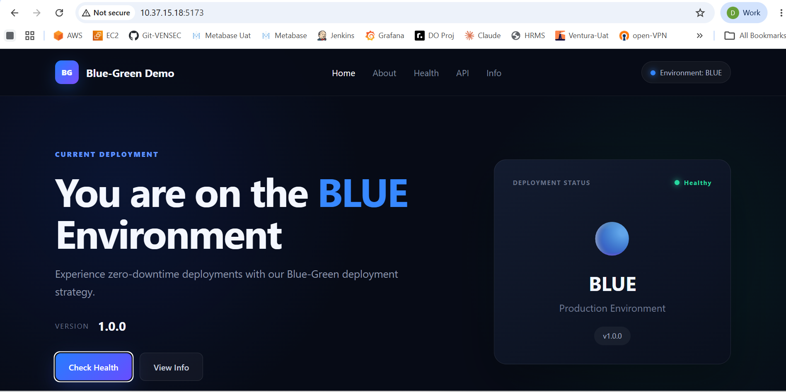
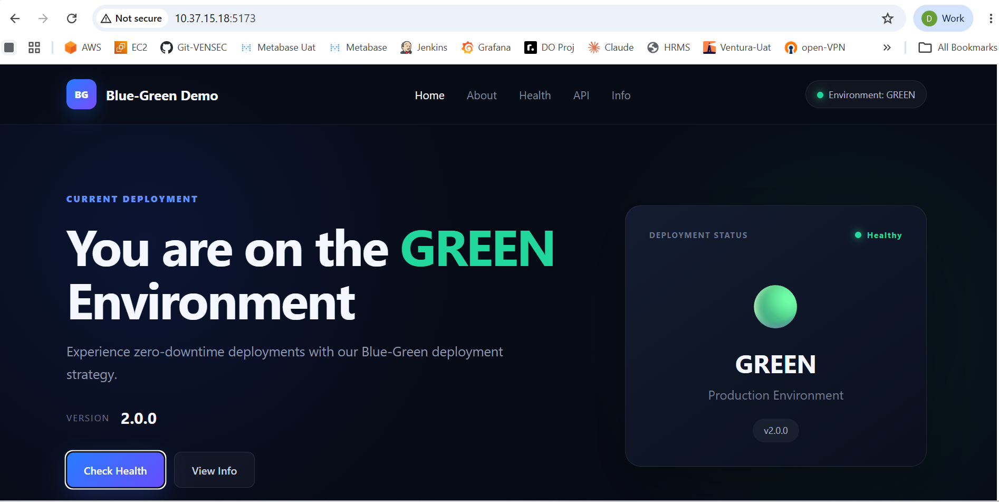
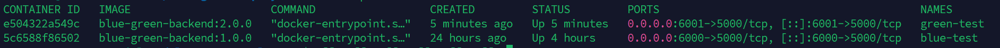
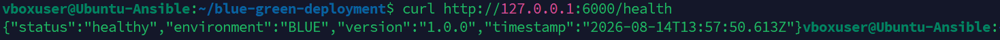
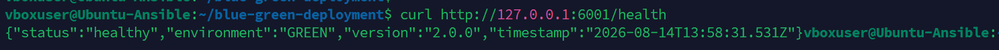
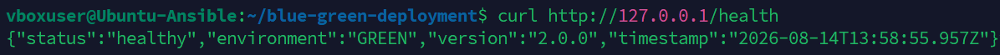
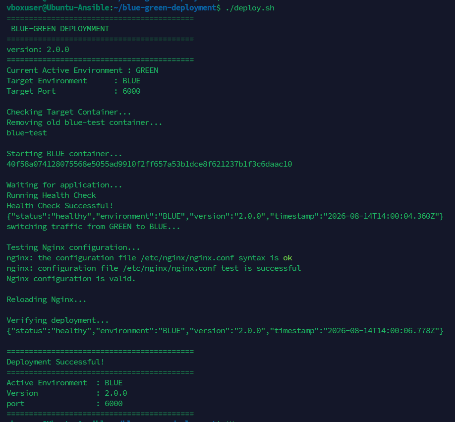
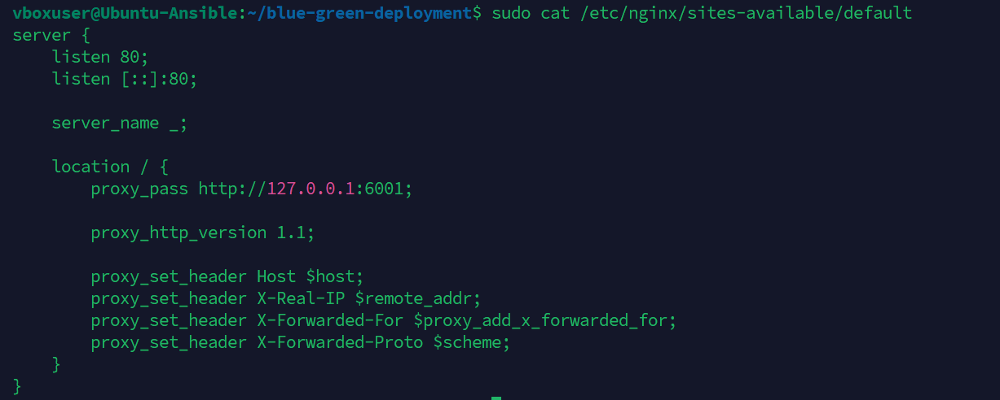
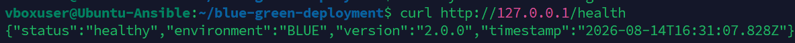

# Blue-Green Deployment

A practical **Blue-Green Deployment** project using a Node.js/Express backend, React/Vite frontend, Docker containers, Nginx reverse proxy, and a Bash deployment script.

The project demonstrates how to run two application versions side by side, verify the new version, switch production traffic with Nginx, and switch traffic back when required.

## Project Overview

This project uses two environments:

- 🔵 **Blue** — Version `1.0.0`
- 🟢 **Green** — Version `2.0.0`

Both environments run in separate Docker containers.

| Environment | Version | Host Port | Container Port |
|---|---:|---:|---:|
| Blue | 1.0.0 | 6000 | 5000 |
| Green | 2.0.0 | 6001 | 5000 |

Nginx listens on port `80` and forwards production traffic to the currently active environment.

---

## Architecture

```text
                         User
                           |
                           v
                    +-------------+
                    |    Nginx    |
                    |    :80      |
                    +------+------+
                           |
                    Production Traffic
                           |
              +------------+------------+
              |                         |
              v                         v
       +-------------+           +-------------+
       |    BLUE     |           |   GREEN     |
       |   v1.0.0    |           |   v2.0.0    |
       |   :6000     |           |   :6001     |
       +-------------+           +-------------+
              |                         |
              +------------+------------+
                           |
                    Docker Containers
```

Only one environment receives production traffic at a time. The other environment can be tested independently and kept ready for deployment or rollback.

---

## Technologies Used

- Node.js
- Express.js
- React
- Vite
- Docker
- Nginx
- Bash
- Git
- GitHub

---

## Project Structure

```text
blue-green-deployment/
│
├── backend/
│   ├── Dockerfile
│   ├── package.json
│   ├── package-lock.json
│   └── server.js
│
├── frontend/
│   ├── public/
│   ├── src/
│   ├── package.json
│   ├── package-lock.json
│   └── vite.config.js
│
├── deploy.sh
├── .dockerignore
├── .gitignore
└── README.md
```

---

# Backend API

The backend is a Node.js + Express application.

### Health Check

```bash
curl http://127.0.0.1:6000/health
```

Blue example:

```json
{
  "status": "healthy",
  "environment": "BLUE",
  "version": "1.0.0"
}
```

Green example:

```bash
curl http://127.0.0.1:6001/health
```

```json
{
  "status": "healthy",
  "environment": "GREEN",
  "version": "2.0.0"
}
```

### API Endpoints

```text
GET /
GET /health
GET /api/version
GET /api/info
```

---

# Docker Containers

The backend application runs on port `5000` inside the container.

Blue is mapped to host port `6000`:

```bash
docker run -d \
  --name blue-test \
  -p 6000:5000 \
  -e ENVIRONMENT=BLUE \
  -e VERSION=1.0.0 \
  blue-green-backend:1.0.0
```

Green is mapped to host port `6001`:

```bash
docker run -d \
  --name green-test \
  -p 6001:5000 \
  -e ENVIRONMENT=GREEN \
  -e VERSION=2.0.0 \
  blue-green-backend:2.0.0
```

Check both containers:

```bash
docker ps
```

---

# Nginx Configuration

Nginx acts as the reverse proxy and controls production traffic.

Example Blue configuration:

```nginx
location / {
    proxy_pass http://127.0.0.1:6000;
}
```

Example Green configuration:

```nginx
location / {
    proxy_pass http://127.0.0.1:6001;
}
```

Before reloading Nginx:

```bash
sudo nginx -t
```

Then:

```bash
sudo systemctl reload nginx
```

---

# Blue-Green Deployment Flow

```text
1. Identify active environment
          |
          v
2. Start target environment
          |
          v
3. Run health check
          |
          v
4. Validate Nginx configuration
          |
          v
5. Switch Nginx traffic
          |
          v
6. Reload Nginx
          |
          v
7. Verify production traffic
```

This allows the new version to be tested before production traffic is switched.

---

# Automated Deployment Script

The project contains:

```text
deploy.sh
```

Run the deployment with:

```bash
./deploy.sh
```

The script automatically:

1. Detects the current active environment.
2. Selects the opposite environment as the deployment target.
3. Removes the old target container if required.
4. Starts the target Docker container.
5. Waits for the application.
6. Performs a health check.
7. Updates the Nginx upstream.
8. Validates Nginx configuration.
9. Reloads Nginx.
10. Verifies the deployment.

Example successful deployment:

```text
Current Active Environment : BLUE
Target Environment         : GREEN
Target Port                : 6001

Health Check Successful!

switching traffic from BLUE to GREEN...

Nginx configuration is valid.

Reloading Nginx...

Deployment Successful!

Active Environment : GREEN
Version            : 2.0.0
Port               : 6001
```

---

# Production Traffic Verification

Production traffic is accessed through Nginx:

```bash
curl http://127.0.0.1/health
```

When Green is active:

```json
{
  "status": "healthy",
  "environment": "GREEN",
  "version": "2.0.0"
}
```

When Blue is active:

```json
{
  "status": "healthy",
  "environment": "BLUE",
  "version": "1.0.0"
}
```

This confirms which environment is currently receiving production traffic.

---

# Rollback / Reverse Traffic Switch

Blue-Green deployment makes rollback simple.

If Green has a problem, traffic can be switched back to Blue.

```text
GREEN v2.0.0
     |
     | Rollback
     v
BLUE v1.0.0
```

The deployment script can detect the current environment and target the opposite environment.

This allows the previous version to become active without rebuilding the application.

---

# Frontend

The project also contains a React/Vite frontend that visually displays the active deployment environment.

The screenshots demonstrate both environments:

- 🔵 Blue environment
- 🟢 Green environment

Frontend can be started with:

```bash
cd frontend
npm install
npm run dev -- --host 0.0.0.0
```

---

# Screenshots

## 1. Frontend — Blue Environment

The frontend showing the Blue environment.



---

## 2. Frontend — Green Environment

The frontend showing the Green environment after deployment.



---

## 3. Docker Containers

Shows the Blue and Green Docker containers running side by side.



---

## 4. Blue Health Check

Health check for Blue version `1.0.0`.



---

## 5. Green Health Check

Health check for Green version `2.0.0`.



---

## 6. Green Production Traffic

Shows production traffic being served by the Green environment.



---

## 7. Blue-Green Deployment

Shows the automated deployment script switching traffic between environments.



---

## 8. Nginx Configuration

Shows the Nginx reverse proxy configuration pointing production traffic to an environment.



---

## 9. Blue Production Traffic / Rollback

Shows production traffic switched back to the Blue environment.



---

# Testing Checklist

### Check Blue

```bash
curl http://127.0.0.1:6000/health
```

### Check Green

```bash
curl http://127.0.0.1:6001/health
```

### Check Production

```bash
curl http://127.0.0.1/health
```

### Check Containers

```bash
docker ps
```

### Validate Nginx

```bash
sudo nginx -t
```

### Reload Nginx

```bash
sudo systemctl reload nginx
```

---

# Key Benefits

### Zero/Minimal Downtime

The new version is started separately before traffic is switched.

### Safer Deployment

The new version can be health-checked before receiving production traffic.

### Fast Rollback

The previous environment remains available and can receive traffic again.

### Easy Traffic Switching

Nginx controls the active environment.

### Automated Deployment

The `deploy.sh` script automates the deployment and verification process.

---

# What I Learned

This project provided practical experience with:

- Docker containerization
- Docker image versioning
- Running multiple application versions
- Node.js and Express
- React and Vite
- Nginx reverse proxy
- Bash scripting
- Health checks
- Traffic switching
- Blue-Green deployment
- Rollback strategy
- Git and GitHub
- Deployment troubleshooting

---

# Future Improvements

The project can be extended with:

- GitHub Actions CI/CD
- Automatic Docker image builds
- Automated deployment after Git push
- Prometheus/Grafana monitoring
- Application metrics
- Automated rollback
- Docker HEALTHCHECK
- AWS EC2/ECS deployment

---

# Conclusion

This project demonstrates a complete Blue-Green Deployment workflow.

A new application version is deployed in a separate Docker container, tested using health checks, and only then exposed to production traffic through Nginx.

The previous environment remains available, making rollback fast and reducing deployment risk.

The project satisfies the core Blue-Green Deployment requirement by deploying the next application version separately and switching traffic only after the new version is ready.
